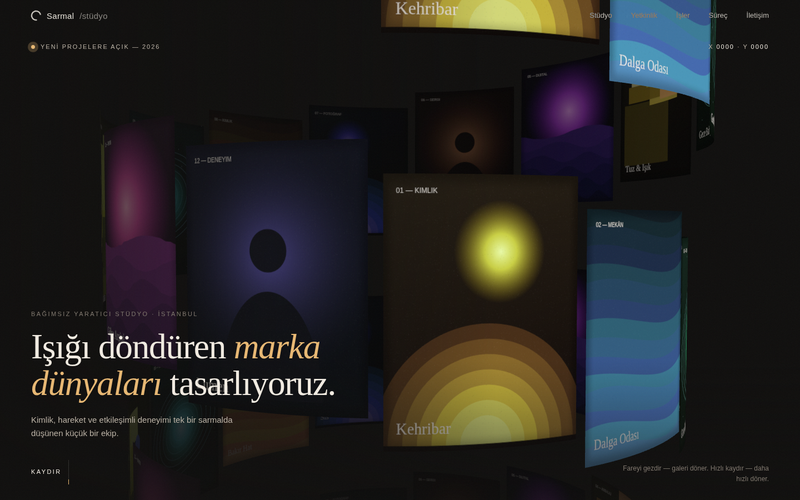

# Sarmal Stüdyo — 3D spiral galerili yaratıcı ajans sitesi

Fare hareketine ve kaydırma hızına tepki veren three.js spiral görsel galerisi olan, özgün tasarımlı tek sayfalık ajans sitesi. Bu klasör depodaki diğer projelerden bağımsızdır.



## Hemen aç

- **Sunucusuz:** `site/dist/index.html` dosyasını çift tıklayın (file:// ile çalışır, internet gerekmez).
- **Yerel sunucu:** `cd site && npm run serve` → http://127.0.0.1:4173
- **Yayın:** `site/dist/` klasörünü olduğu gibi herhangi bir statik barındırmaya (Netlify, GitHub Pages, Hostinger vb.) yükleyin. Yayın hesabı bu görevde kullanılmadı.

## Geliştirme

```bash
cd site
npm install        # three 0.186.1, lenis 1.3.26, esbuild, playwright-core
npm run build      # src/ → dist/ (tek IIFE app.js + styles.css)
npm test           # 19 gerçek-tarayıcı kabul kontrolü; ekran görüntüleri test-output/
```

Test, Chromium yolunu `/opt/pw-browsers/...` altında arar; başka makinede `CHROMIUM_PATH=/yol/chrome npm test` verin.

## Ne var

| Bölüm | Davranış |
|---|---|
| Kahraman | 48 kavisli karodan 4 turluk spiral; fare X ile döner + eğilir; kaydırma hızı dönüşü artırır; kaydırma kamerayı spiral boyunca indirir; karo hover’ında karo geri çekilir ve imleçte eser adı çıkar; imleç X/Y göstergesi |
| Stüdyo / Yetkinlik / İşler / Süreç / İletişim | Kaydırmayla tetiklenen yavaş girişler (kelime maskeli başlıklar, blok fade-up); hizmet satırı hover’ı; büyük görseller hover’da 1.12 → 1.00 yavaşça geri çekilir |
| Erişilebilirlik | `prefers-reduced-motion` desteği, “İçeriğe geç” bağlantısı, klavye odak çizgisi, WebGL yoksa statik yedek |

Tüm galeri ayarları tek yerde: `site/src/config.js` (görsel sayısı, tur, yarıçap, boşluk, hız, fare/kaydırma katsayıları, hover miktarı).

## Kabul sonucu (Linux, headless Chromium 1194 / SwiftShader)

19/19 kontrol geçti — ayrıntı `kanit/sonuc.json`, görseller `kanit/`. Özet:

- Fare: sol kenarda rot −0.49 rad, sağ kenarda +0.49 rad; ekran görüntüsünde piksellerin %44’ü değişti.
- Kaydırma: 0.8 sn’lik dönüş — boşta 0.05, yavaş kaydırma 10.2, hızlı kaydırma 28.8 (rad, birikimli).
- Başlık: 1440 px genişlikte 63 px (ilk sürüm `clamp(54px, 9.6vw, 160px)` → 138 px; oran 0.46).
- Yavaş yazılar: bölüm görünmeden önce opaklık 0, kaydırınca ≈1.3 sn’de 1; 27/27 giriş tetiklendi.
- Galeri bozulmadı: sayfanın sonuna gidip dönünce çizim ve fare tepkisi sürüyor; masaüstü/mobil/reduced-motion/file:// testlerinde konsol hatası yok.

**Yapılmayan testler:** gerçek Windows masaüstü tarayıcısı, gerçek telefon (yalnızca 390×844 mobil emülasyonu yapıldı), Safari/Firefox, gerçek GPU’da FPS ölçümü.

## Gerçek veri gereken yerler (uydurulmadı)

- **Portföy görselleri:** galeri ve “İşler” bölümündeki 12 görsel, `site/src/artwork.js` içinde prosedürel üretilen özgün çizimlerdir. Gerçek proje fotoğrafları kullanılacaksa sağlanmalı ve lisansı net olmalıdır (yerel görseller sunucu üzerinden servis edilmelidir; file:// altında WebGL dokusu olarak yüklenemez).
- **Stüdyo adı, metinler ve “İşler” başlıkları** örnek/konsept içeriktir; gerçek marka bilgileri gelince `index.html` ve `artwork.js` içindeki `WORKS` güncellenmeli.
- **İletişim e-postası** `merhaba@sarmal.example` ayrılmış (çalışmayan) örnek alan adıdır; gerçek adres verilmelidir.
- **Yayın:** canlı URL için barındırma hesabı/erişimi gerekir.

## Lisanslar

three.js (MIT) ve Lenis (MIT) lisans metinleri `site/dist/assets/LICENSE-*.txt` olarak dağıtımla birlikte gelir. İlham alınan repo (YildizDikme/3D-threejs-spiral-gallery) lisans dosyası içermediği için kodu veya görselleri kopyalanmadı; bu proje sıfırdan yazıldı.

Plan ve kaynaklar: [harita.md](harita.md) · Süreç kaydı: [calisma-gunlugu.md](calisma-gunlugu.md)
