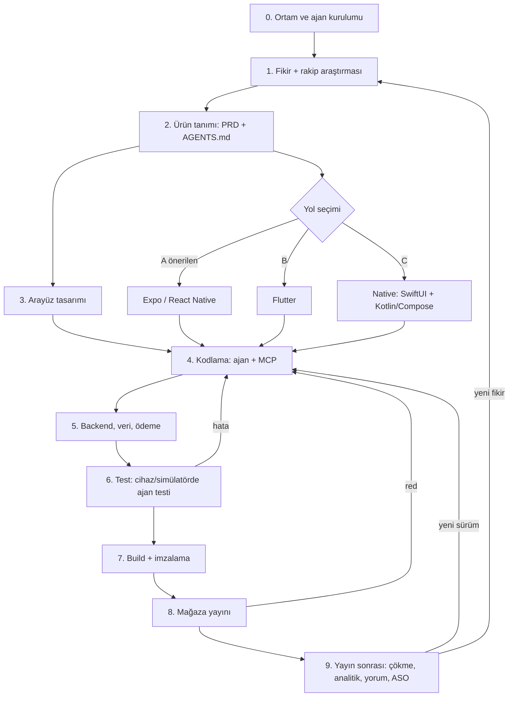

# AI ile Mobil Uygulama Üretim Kaynak Haritası

> Fikirden mağazaya, yapay zekâ ajanlarıyla (Claude Code, Codex, Cursor, Gemini, Xcode/Android Studio ajanları)
> mobil uygulama üretmek için **hangi repo, SDK, MCP, araç ve sitenin hangi aşamada ne işe yaradığını** gösteren,
> birbirine bağlı adımlar, kabul ölçütleri ve A/B/C yollarıyla kurulmuş harita.
>
> Araştırma tarihi: **2026-10-03**. Bütün bağlantılar HTTPS'tir ve bu tarihte gerçek HTTP isteğiyle ya da
> `git ls-remote` ile kontrol edilmiştir (bkz. [`kanit/link-kontrol.md`](kanit/link-kontrol.md)).
> Kurulum komutları, aksi belirtilmedikçe, ilgili **resmî dokümandan** alınmıştır.

---

## 0. Haritanın kısa hali



| Aşama | Ne üretir | Ana AI aracı / MCP | Kabul ölçütü (özet) |
|---|---|---|---|
| 0 | Çalışan ajan + MCP bağlantıları | Claude Code / Codex / Cursor + `claude mcp list` | Gereken MCP'ler "connected" |
| 1 | Rakip tablosu, şikâyet temaları, özellik listesi | [`rakip-arastirma/rakip.mjs`](rakip-arastirma/rakip.mjs), AppTweak MCP, Mobbin MCP, ASO Skills | ≥5 rakip, ≥200 yorum, ≥5 tema |
| 2 | PRD + `AGENTS.md`/`CLAUDE.md` | LLM + Expo/Flutter agent dosyaları | Her v1 özelliğinin kabul testi yazılı |
| 3 | Ekran tasarımları + tasarım sistemi | Google Stitch, Figma MCP, Mobbin, HIG, Material 3 | Ana akışın tüm ekranları + token'lar |
| 4 | Çalışan uygulama kodu | Expo MCP / Dart-Flutter MCP / Xcode `mcpbridge` / Android Studio Agent | Lint + tip kontrolü + unit test yeşil |
| 5 | Auth, veri, ödeme | Supabase MCP / Firebase MCP / RevenueCat MCP | Gerçek hesapla kayıt-giriş-satın alma (sandbox) |
| 6 | Otomatik UI testleri + kanıt ekran görüntüleri | mobile-mcp, Maestro MCP, agent-device, Journeys | Ana akış E2E testi iki platformda geçer |
| 7 | İmzalı `.ipa` / `.aab` | EAS Build, Xcode, fastlane | Build başarılı, TestFlight/kapalı test yüklendi |
| 8 | Mağazada yayın | EAS Submit, App Store Connect API/MCP, Play Console | İnceleme onayı |
| 9 | Çökme, analitik, yorum yanıtı, ASO | Crashlytics MCP, Sentry MCP, PostHog MCP, Expo MCP, ASO Skills | Çökmesiz oturum ≥ %99, yorumlar yanıtlanıyor |

---

## 1. Yol seçimi: A / B / C (ve D kaçış yolu)

### A — Expo / React Native + kodlama ajanı (**önerilen varsayılan**)

- **Neden:** Tek kod tabanı iOS + Android (+ web). Expo, 2026 itibarıyla ajanlar için en hazır ekosisteme sahip:
  resmî Claude Code eklentisi, resmî uzak MCP sunucusu (`https://mcp.expo.dev/mcp`), Skills deposu,
  `llms.txt`, ve bulut build (EAS) sayesinde **Windows/Linux'tan iOS build** alınabiliyor (Mac yalnız iOS
  simülatörü için gerekli). Resmî kaynak: <https://docs.expo.dev/agents>, <https://docs.expo.dev/eas/ai/mcp/>.
- **Ne zaman seçilmez:** Ağır 3B/oyun, çok derin platform API'si (ör. ileri CarPlay, kamera işleme hattı) gerekiyorsa C.
- **Gerçek üretim kanıtı:** FERASET "Music AI" (4 haftada mağazaya, ABD App Store'da #1) ve CineMe (36 günde iki
  mağaza) Expo ile üretildi — bkz. §4.

### B — Flutter + Dart/Flutter MCP

- **Neden:** Tek kod tabanı, piksel hassas UI, Google'ın resmî AI araç seti: Dart ve Flutter MCP sunucusu
  (analiz hataları, sembol çözümleme, çalışan uygulamayı inceleme, pub.dev araması, test çalıştırma),
  resmî ajan eklentileri ve kurallar. Resmî kaynak: <https://docs.flutter.dev/ai/mcp-server>,
  <https://docs.flutter.dev/ai/tools>, <https://github.com/flutter/agent-plugins>.
- **Ne zaman:** Ekip Dart biliyorsa, Firebase merkezliyse, özel çizimli/marka ağırlıklı UI isteniyorsa.
- **Fark:** Bulut build için Expo EAS gibi tek resmî servis yok; Codemagic/GitHub Actions + fastlane kullanılır;
  iOS build için macOS runner gerekir.

### C — Native: SwiftUI (Xcode 26.3+) + Kotlin/Jetpack Compose (Android Studio)

- **Neden:** En iyi platform deneyimi ve en yeni API'ler. İki IDE de 2026'da ajanları resmî olarak destekliyor:
  Xcode 26.3+ harici ajanlara MCP açar (`xcrun mcpbridge`) —
  <https://developer.apple.com/documentation/xcode/giving-external-agents-access-to-xcode>;
  Android Studio'da Gemini **Agent Mode** + MCP + Journeys testleri —
  <https://developer.android.com/studio/gemini/agent-mode>.
- **Bedel:** İki ayrı kod tabanı, iOS için Mac zorunlu, iki kat test.

### D — Kaçış yolu: AI uygulama oluşturucular (prototip / teknik olmayan kurucu)

- Rork (Expo/React Native projesi üretir) <https://rork.com>, FlutterFlow <https://www.flutterflow.io>.
  Bolt <https://bolt.new> ve Lovable <https://lovable.dev> ağırlıkla **web** odaklıdır.
- Kullanım: Fikri 1 günde tıklanabilir hale getirmek; sonra kodu dışa aktarıp A/B yoluna geçmek.
  Üretimde kilitlenme (vendor lock-in) ve kod kalitesi riski nedeniyle ana yol yapılmadı.

### Seçim kuralı (rutin karar)

1. Ekipte Swift/Kotlin uzmanı yok **ve** iki mağaza hedefleniyor → **A**.
2. Ekip Dart/Flutter biliyor veya Firebase merkezli → **B**.
3. Tek platform + derin donanım/API → **C** (yalnız o platform).
4. Sadece fikir doğrulama → **D**, doğrulanınca A/B'ye taşı.
5. **Yol kırılırsa:** A'da bir native modül yoksa → Expo "development build" + config plugin / native modül
   (Expo Modules API); yine olmuyorsa ilgili ekranı C ile yaz. B'de paket yoksa → platform channel. C'de ikinci
   platform maliyeti yüksekse → A'ya geç.

---

## 2. Aşama aşama harita (bağımlılık → araç → AI ile nasıl → çıktı → kabul → kırılırsa)

### Aşama 0 — Ortam ve ajan kurulumu

- **Bağımlılık:** Yok (başlangıç). Node.js 20+, Git; iOS için macOS + Xcode; Android için Android Studio/SDK.
- **Ajanlar (birini seç):**
  - Claude Code — <https://code.claude.com/docs/en/overview>, MCP: <https://code.claude.com/docs/en/mcp>
  - OpenAI Codex — <https://developers.openai.com/codex>
  - Gemini CLI — <https://github.com/google-gemini/gemini-cli>
  - Cursor — <https://cursor.com/docs>
  - IDE içi: Xcode (Claude Agent/Codex), Android Studio Gemini Agent Mode
- **MCP standardı:** <https://modelcontextprotocol.io>
- **Komutlar (yola göre):**
  ```bash
  # A (Expo) — resmî: https://docs.expo.dev/agents
  claude plugin install expo@claude-plugins-official
  claude mcp add --transport http expo https://mcp.expo.dev/mcp   # sonra oturumda /mcp ile giriş
  # B (Flutter) — resmî: https://docs.flutter.dev/ai/mcp-server
  claude plugin marketplace add flutter/agent-plugins
  claude plugin install dart-flutter@dart-flutter                 # Dart MCP: `dart mcp-server`
  # C-iOS — resmî: Apple "Giving external agents access to Xcode"
  claude mcp add --transport stdio xcode -- xcrun mcpbridge       # Xcode > Settings > Intelligence'ta izin aç
  # C-Android — Android Studio > Settings > Tools > AI > MCP Servers (mcp.json; HTTP/SSE, stdio yok)
  ```
- **Kabul:** `claude mcp list` (veya `codex mcp list`) çıktısında gereken sunucular bağlı; ajan bir doküman
  sorusunu MCP üzerinden yanıtlıyor.
- **Kırılırsa:** Uzak MCP OAuth'u açılmıyorsa → yerel/stdio alternatifini kullan (ör. Figma için
  <https://github.com/GLips/Figma-Context-MCP>); Android Studio stdio desteklemediği için yerel sunucuları
  Claude Code/Gemini CLI tarafında çalıştır.

### Aşama 1 — Fikir + rakip araştırması

- **Bağımlılık:** Aşama 0 (ajan), bir kategori/arama terimi.
- **Araçlar:**
  - **Bu depodaki çalıştırılabilir araç:** [`rakip-arastirma/rakip.mjs`](rakip-arastirma/rakip.mjs) —
    App Store + Google Play'den rakipleri, meta verileri ve yorumları toplar, 1-2 yıldızlı yorumlarda şikâyet
    kelime frekansı çıkarır, LLM'e hazır istem yazar. Hesap/anahtar gerektirmez. Alttaki kütüphaneler:
    <https://github.com/facundoolano/app-store-scraper>, <https://github.com/facundoolano/google-play-scraper>
    (Python alternatifi: <https://github.com/JoMingyu/google-play-scraper>).
  - MCP ile mağaza verisi: AppTweak MCP (ücretli API anahtarı) <https://developers.apptweak.com/reference/mcp>;
    topluluk App Store/Play scraper MCP <https://github.com/appreply-co/mcp-appstore>.
  - Pazar zekâsı (ücretli): AppTweak <https://www.apptweak.com>, Sensor Tower <https://sensortower.com>,
    Appfigures <https://appfigures.com>. Karşılaştırma: <https://www.apptweak.com/en/alternative-to-sensor-tower>,
    <https://www.g2.com/compare/apptweak-vs-sensor-tower>.
  - ASO ajan becerileri (Claude Code/Codex/Cursor): <https://github.com/Eronred/aso-skills>
    (tanıtım: <https://expo.dev/blog/aso-skills-aso-in-your-ai-workflow>).
  - Rakip UI/akış referansı: Mobbin (MCP'si ücretli planlarda, beta) <https://mobbin.com>.
  - Talep sinyali: Google Trends <https://trends.google.com>, Product Hunt <https://www.producthunt.com>.
- **AI ile nasıl:**
  ```bash
  cd rakip-arastirma && npm install
  node rakip.mjs --terim "habit tracker" --ulke tr --dil tr --adet 5 --yorum 200
  # cikti/<terim>-<ulke>/llm-istemi.md → ajana ver: temalar, karşılanmamış ihtiyaç, v1 özellik listesi
  ```
- **Çıktı:** `rakipler.csv`, `yorumlar.csv`, `rapor.md`, `llm-istemi.md` → LLM'den "şikâyet teması →
  karşılanmamış ihtiyaç → v1 özelliği" tablosu.
- **Kabul:** ≥5 rakip (iki mağaza), ≥200 yorum, ≥5 şikâyet teması, her v1 özelliği en az bir gerçek yoruma
  dayanıyor. **Bu depoda çalıştırılmış örnek:** [`rakip-arastirma/cikti/habit-tracker-tr/rapor.md`](rakip-arastirma/cikti/habit-tracker-tr/rapor.md)
  (6 rakip, 354 yorum; Türkçe dil desteği eksikliği en sık şikâyetlerden biri çıktı).
- **Kırılırsa:** Scraper engellenirse (429/403) → bekle + `--adet` düşür, ya da AppTweak/Appfigures API/MCP'ye geç;
  App Store RSS yorumları sınırlıysa → Play yorumlarına ağırlık ver.

### Aşama 2 — Ürün tanımı (PRD) ve ajan talimatları

- **Bağımlılık:** Aşama 1 özellik listesi.
- **Araçlar:** LLM (sohbet), Expo'nun hazır `AGENTS.md` şablonu
  (`curl -o AGENTS.md https://raw.githubusercontent.com/expo/expo/main/packages/create-expo/template/agent-files/AGENTS.md`,
  kaynak: <https://docs.expo.dev/agents>), Flutter kuralları <https://github.com/flutter/agent-plugins>,
  Callstack ajan becerileri <https://github.com/callstackincubator/agent-skills>.
- **AI ile nasıl:** Ajandan PRD iste: hedef kullanıcı, v1 kapsamı (≤5 özellik), ekran listesi, veri modeli,
  her özellik için Given/When/Then kabul testi, kapsam dışı listesi. Sonra `AGENTS.md`/`CLAUDE.md` içine:
  yol (A/B/C), klasör yapısı, "her değişiklikten sonra lint+test çalıştır", yasaklar (gizli anahtar commit'leme).
- **Kabul:** Her v1 özelliğinin ölçülebilir kabul testi var; ajan talimat dosyası repoda.
- **Kırılırsa:** Kapsam büyüyorsa → v1'i 3 özelliğe indir (topluluk dersi: "AI death spiral"ı kapsam büyütür).

### Aşama 3 — Arayüz (UI/UX) tasarımı

- **Bağımlılık:** Aşama 2 ekran listesi.
- **Araçlar:**
  - Google Stitch (Gemini tabanlı metin/eskizden UI; Figma'ya ve HTML/Flutter/SwiftUI'ye dışa aktarım)
    <https://stitch.withgoogle.com>; ajana bağlamak için Stitch MCP <https://github.com/davideast/stitch-mcp>.
  - Figma MCP (resmî; uzak sunucu `https://mcp.figma.com/mcp`, tasarım bağlamı + tuvale yazma)
    <https://help.figma.com/hc/en-us/articles/32132100833559-Guide-to-the-Figma-MCP-server>.
    Komut: `claude mcp add --transport http figma https://mcp.figma.com/mcp`
  - Gerçek uygulama ekran referansı: Mobbin <https://mobbin.com>.
  - Platform kuralları: Apple HIG <https://developer.apple.com/design/human-interface-guidelines>,
    Material 3 <https://m3.material.io>.
- **AI ile nasıl:** Stitch'te ekranları üret → Figma'ya aktar → token'ları (renk, tipografi, boşluk) sabitle →
  ajana "Figma MCP ile şu frame'in tasarım bağlamını al, mevcut bileşenlerimizle RN/Flutter/SwiftUI koduna çevir" de.
- **Kabul:** Ana akışın tüm ekranları + boş/hata/yükleniyor durumları + koyu tema; tasarım token'ları kodda
  tek dosyada; HIG/M3 dokunma hedefi ≥44pt/48dp.
- **Kırılırsa:** Figma ücretli koltuk yoksa → Stitch HTML/Flutter dışa aktarımı veya ekran görüntüsünü
  doğrudan ajana ver.

### Aşama 4 — Kodlama (ajan + MCP)

- **Bağımlılık:** Aşama 0, 2, 3.
- **A (Expo):** Proje: <https://docs.expo.dev/get-started/create-a-project/> (`npx create-expo-app@latest`);
  Expo Skills <https://github.com/expo/skills>; doküman haritası <https://docs.expo.dev/llms.txt>;
  yerel MCP yetenekleri (SDK 54+): `npx expo install expo-mcp --dev` ve
  `EXPO_UNSTABLE_MCP_SERVER=1 npx expo start` (simülatör ekran görüntüsü, dokunma, DevTools).
- **B (Flutter):** Dart/Flutter MCP (analizör, test, pub.dev) <https://docs.flutter.dev/ai/mcp-server>;
  beceriler <https://github.com/dart-lang/skills>; uygulama içi AI özelliği için Flutter AI Toolkit
  <https://docs.flutter.dev/ai/ai-toolkit>, Genkit Dart <https://genkit.dev/docs/dart/get-started>.
- **C (Native):** Xcode <https://developer.apple.com/xcode/> + `xcrun mcpbridge` (derleme, tanılama, SwiftUI
  önizleme); Jetpack Compose <https://developer.android.com/compose> + Android Studio Agent Mode
  ("Create project with AI": <https://developer.android.com/studio/gemini/create-a-new-project-with-ai>).
- **AI ile nasıl (iş akışı, Expo'nun önerisi):** Görev başına ayrı dal/oturum; bağlamı ~%50 altında tut;
  beceri (Skill) → MCP → disiplinli sohbet sırası. Kaynak:
  <https://expo.dev/blog/how-to-build-mobile-apps-with-ai-the-three-tools-that-actually-matter>.
- **Kabul:** `tsc`/`dart analyze` hatasız, lint temiz, unit testler yeşil, uygulama gerçek cihazda/simülatörde açılıyor.
- **Kırılırsa:** Aynı hata 3 denemede çözülmüyorsa → yaklaşımı değiştir (topluluk dersi, bkz. §5);
  Expo Go SDK uyuşmazlığında → development build'e geç.

### Aşama 5 — Backend, veri, kimlik doğrulama, ödeme

- **Bağımlılık:** Aşama 4 iskelet + PRD veri modeli.
- **Araçlar (MCP'li):**
  - Supabase (Postgres, auth, storage) — uzak MCP `https://mcp.supabase.com/mcp`
    <https://supabase.com/docs/guides/getting-started/mcp>, kaynak kod <https://github.com/supabase-community/supabase-mcp>.
    Komut: `claude mcp add --transport http supabase https://mcp.supabase.com/mcp`
  - Firebase (auth, Firestore, Crashlytics, AI Logic) — `npx -y firebase-tools@latest mcp`
    <https://firebase.google.com/docs/ai-assistance/mcp-server>; uygulama içi Gemini: <https://firebase.google.com/docs/ai-logic>.
  - RevenueCat (abonelik/IAP, paywall) — uzak MCP `https://mcp.revenuecat.ai/mcp`
    <https://www.revenuecat.com/docs/tools/mcp>.
- **Kabul:** Test hesabıyla kayıt → giriş → veri yazma/okuma → sandbox satın alma uçtan uca çalışıyor; RLS/güvenlik
  kuralları açık; hiçbir gizli anahtar istemci koduna gömülü değil.
- **Kırılırsa:** MCP yazma yetkisi riskliyse → salt-okunur modda kullan, şema değişikliklerini migration dosyasıyla yap.

### Aşama 6 — Test (ajanın uygulamayı gerçekten kullanması)

- **Bağımlılık:** Aşama 4-5 çalışan build.
- **Araçlar:**
  - mobile-mcp (iOS/Android simülatör, emülatör, gerçek cihaz; erişilebilirlik ağacı) <https://github.com/mobile-next/mobile-mcp>
    — `claude mcp add mobile-mcp -- npx -y @mobilenext/mobile-mcp@latest`
  - Maestro + MCP (akış yaz-çalıştır-sonuç oku) <https://maestro.dev/mcp>, <https://docs.maestro.dev> —
    `claude mcp add maestro -- maestro mcp`; örnek: <https://verygood.ventures/blog/maestro-mcp-claude-mobile-ui-test-automation/>
  - agent-device (Callstack; snapshot + seçici tabanlı, "dogfood" keşif testi) <https://github.com/callstackincubator/agent-device>,
    Expo rehberi <https://docs.expo.dev/agents/agent-device/>
  - Android Studio Journeys (doğal dille UI testi) <https://developer.android.com/studio/gemini/journeys>
  - CI'da AI QA ajanı: <https://expo.dev/blog/build-an-ai-qa-agent-for-expo-apps-with-eas-workflows-in-minutes-today>;
    hatayı bulut simülatörde yeniden üretip PR açan akış (EAS Simulator erken erişim):
    <https://expo.dev/blog/agent-fixes-bugs-on-eas-simulator>
- **Kabul:** PRD'deki her kabul testi bir Maestro/Journeys akışı olarak iki platformda geçiyor; kanıt ekran görüntüleri
  saklanıyor; erişilebilirlik etiketleri mevcut.
- **Kırılırsa:** Simülatör yoksa (Linux/Windows) → Android emülatörü + bulut iOS (EAS/BrowserStack) ya da gerçek cihaz.

### Aşama 7 — Build ve imzalama

- **Bağımlılık:** Aşama 6 yeşil; Apple Developer Program ve Google Play Console hesapları.
- **Araçlar:** EAS Build <https://docs.expo.dev/build/introduction/> (`eas build --platform all`; iOS'u bulutta derler),
  fastlane <https://docs.fastlane.tools>, Xcode Archive, Android Studio "Generate Signed Bundle".
- **Kabul:** İmzalı `.ipa` ve `.aab` üretildi; TestFlight'a ve Play "kapalı test" kanalına yüklendi.
- **Kırılırsa:** Sertifika/provisioning hatası → EAS'ın yönetilen kimlik bilgilerine geç; fastlane `match`.

### Aşama 8 — Mağaza yayını

- **Bağımlılık:** Aşama 7.
- **Araçlar:** EAS Submit <https://docs.expo.dev/submit/introduction/>; App Store Connect API
  <https://developer.apple.com/documentation/appstoreconnectapi>; topluluk ASC MCP (meta veri, ekran görüntüsü,
  TestFlight, gönderim) <https://github.com/pofky/asc-mcp>; Expo MCP TestFlight/inceleme verisine de erişir.
- **Kurallar (red sebepleri):** App Store İnceleme Kuralları <https://developer.apple.com/app-store/review/guidelines/>
  — AI ile yazılmış olmak tek başına red sebebi değil; asıl riskler **4.2 asgari işlevsellik** (web sarmalayıcı,
  çok basit), **4.3 spam/kopya**, **2.5.2** (incelemeden sonra işlevi değiştiren kod indirme).
  Google Play: 13 Kasım 2023 sonrası açılan **kişisel** hesaplarda üretime çıkmadan önce
  **en az 12 test kullanıcısı, 14 gün kesintisiz** kapalı test zorunlu
  <https://support.google.com/googleplay/android-developer/answer/14151465> (topluluk yorumu:
  <https://levelup.gitconnected.com/the-12-tester-tax-google-plays-closed-testing-rule-is-quietly-killing-solo-devs-2cea83c2e338>).
- **Kabul:** Her iki mağazada "Yayında"; gizlilik etiketi/Data safety formu doğru.
- **Kırılırsa:** Red → gerekçeyi ajana ver, ilgili kuralı düzelt (Aşama 4'e dön). Play 12 test kullanıcısı yoksa →
  tüzel (organization) hesap (D-U-N-S) veya gerçek beta topluluğu.

### Aşama 9 — Yayın sonrası: izleme, yorum, ASO, OTA güncelleme

- **Bağımlılık:** Aşama 8.
- **Araçlar:** Crashlytics MCP <https://firebase.google.com/docs/crashlytics/ai-assistance-mcp>;
  Sentry MCP (`claude mcp add --transport http sentry https://mcp.sentry.dev/mcp/<org>/<proje>`)
  <https://docs.sentry.io/product/sentry-mcp/>; PostHog MCP (ürün analitiği) <https://posthog.com/docs/model-context-protocol>;
  EAS Update (JS/asset için OTA; native değişiklik değil) <https://docs.expo.dev/eas-update/introduction/>;
  Expo MCP ile App Store/Play yorumlarını okuma-yanıtlama; ASO Skills <https://github.com/Eronred/aso-skills>;
  rakip takibi için Aşama 1 betiğini periyodik çalıştırma.
- **Kabul:** Çökmesiz oturum oranı ≥ %99; 1-2 yıldızlı yorumların tamamı 72 saat içinde yanıtlanmış; her sürümde
  ASO metni ölçülüp güncellenmiş.
- **Döngü:** Yeni şikâyet temaları → Aşama 1'e; hata → Aşama 4'e.

---

## 3. MCP / SDK / araç kataloğu (hangi aşamada ne işe yarar)

| Kaynak | Tür | Aşama | Ne işe yarar | Sahibi | Bağlantı |
|---|---|---|---|---|---|
| Expo MCP | Uzak MCP | 4,6,7,8,9 | Doküman, paket kurulumu, EAS build/workflow, simülatör ekran görüntüsü/dokunma, TestFlight çökme & mağaza yorumları | Resmî (Expo) | <https://docs.expo.dev/eas/ai/mcp/> |
| Expo Skills | Ajan becerileri | 2,4 | Expo'ya özel talimat/slash komutları | Resmî | <https://github.com/expo/skills> |
| Dart & Flutter MCP | Yerel MCP | 4,6 | Analizör, sembol, çalışan uygulama, pub.dev, test, format | Resmî (Google) | <https://docs.flutter.dev/ai/mcp-server> |
| Flutter agent-plugins | Eklenti+kural | 2,4 | Claude Code eklentisi, kurallar, a11y ajanı | Resmî | <https://github.com/flutter/agent-plugins> |
| Xcode `mcpbridge` | Yerel MCP | 4,6 | Proje yapısı, build, tanılama, SwiftUI önizleme | Resmî (Apple) | <https://developer.apple.com/documentation/xcode/giving-external-agents-access-to-xcode> |
| Android Studio Agent Mode + MCP | IDE ajanı | 4,6 | Çok dosyalı değişiklik, build-fix, Journeys | Resmî (Google) | <https://developer.android.com/studio/gemini/add-mcp-server> |
| Figma MCP | Uzak MCP | 3,4 | Tasarım bağlamı → kod, tuvale yazma | Resmî (Figma) | <https://help.figma.com/hc/en-us/articles/32132100833559-Guide-to-the-Figma-MCP-server> |
| Figma-Context-MCP | Yerel MCP | 3,4 | Figma API anahtarıyla düzen verisi (resmî alternatif) | Topluluk | <https://github.com/GLips/Figma-Context-MCP> |
| Stitch MCP | MCP | 3 | Stitch ekran kodu/görseli ajana | Topluluk (Google çalışanı) | <https://github.com/davideast/stitch-mcp> |
| Mobbin MCP | Uzak MCP | 1,3 | Gerçek uygulama ekran/akış referansı | Ticari (ücretli, beta) | <https://mobbin.com> |
| Supabase MCP | Uzak MCP | 5 | Tablo, sorgu, auth, edge function | Resmî | <https://supabase.com/docs/guides/getting-started/mcp> |
| Firebase MCP | Yerel MCP | 5,9 | Proje, Firestore, auth, Crashlytics | Resmî (Google) | <https://firebase.google.com/docs/ai-assistance/mcp-server> |
| RevenueCat MCP | Uzak MCP | 5,9 | Ürün, entitlement, offering, paywall | Resmî | <https://www.revenuecat.com/docs/tools/mcp> |
| mobile-mcp | Yerel MCP | 6 | Simülatör/emülatör/cihazda dokunma, ekran, a11y ağacı | Açık kaynak (Apache-2.0) | <https://github.com/mobile-next/mobile-mcp> |
| Maestro MCP | Yerel MCP | 6 | UI test akışı yaz/çalıştır | Resmî (Maestro) | <https://maestro.dev/mcp> |
| agent-device | CLI/beceri | 6 | Snapshot tabanlı otomasyon, dogfood testi | Callstack | <https://github.com/callstackincubator/agent-device> |
| asc-mcp | Yerel MCP | 8 | App Store Connect: meta veri, build, TestFlight, gönderim | Topluluk | <https://github.com/pofky/asc-mcp> |
| Sentry MCP | Uzak MCP | 9 | Hata/performans analizi | Resmî | <https://docs.sentry.io/product/sentry-mcp/> |
| PostHog MCP | Uzak MCP | 9 | Ürün analitiği, feature flag | Resmî | <https://posthog.com/docs/model-context-protocol> |
| AppTweak MCP | Uzak MCP | 1,9 | ASO/keyword/pazar verisi (API anahtarı) | Ticari | <https://developers.apptweak.com/reference/mcp> |
| mcp-appstore | Yerel MCP | 1 | App Store + Play arama/analiz | Topluluk | <https://github.com/appreply-co/mcp-appstore> |
| ASO Skills | Ajan becerileri | 1,9 | ASO denetimi, keyword, meta veri | Topluluk | <https://github.com/Eronred/aso-skills> |
| app-store-scraper / google-play-scraper | npm SDK | 1 | Rakip meta veri + yorum | Açık kaynak | <https://github.com/facundoolano/app-store-scraper>, <https://github.com/facundoolano/google-play-scraper> |

npm paket varlığı 2026-10-03'te `npm view` ile doğrulandı: [`kanit/npm-paket-kontrol.tsv`](kanit/npm-paket-kontrol.tsv).

---

## 4. Gerçek üretim örnekleri (kanıtlı)

Ayrım önemli: **"AI ile geliştirilmiş"** ile **"AI özellikli"** uygulama farklıdır. Aşağıda hangisi olduğu ayrıca yazıldı.

| Örnek | Ne kanıtlıyor | Kanıt | Doğrulama |
|---|---|---|---|
| **FERASET – Music AI** (İstanbul) | Expo ile 4 haftada ilk koddan App Store onayına; ABD App Store'da #1. Cihaz üstü LLM (Apple Foundation Models, ML Kit Prompt API) için açık kaynak `expo-ai-kit`. *AI özellikli + Expo üretim hattı.* | <https://expo.dev/blog/from-istanbul-to-1-in-the-us-app-store-why-feraset-bet-its-ai-app-studio-on-expo> (23 Nis 2026) | Sayfa HTTP 200; içerik okundu |
| **CineMe** | Tek RN/Expo kod tabanı, 36 günde iki mağaza; uzun AI işleri için async iş + polling deseni. *AI özellikli.* | <https://expo.dev/blog/how-to-ship-an-ai-mobile-app-fast-with-expo>; mağaza: <https://apps.apple.com/gb/app/cineme/id6760482145>, <https://play.google.com/store/apps/details?id=com.aiconversations.cineme> | iTunes Lookup API: "CineMe: AI Video Generator", AI Conversations Limited, v1.0.13 (2026-07-18); Play sayfası HTTP 200 |
| **Expo "app fixes itself" akışı** | Etiketli GitHub issue → EAS Workflows → Claude Code bulut simülatörde hatayı üretir, düzeltir, kanıtla PR açar. *AI ile geliştirme hattı.* EAS Simulator erken erişimde. | <https://expo.dev/blog/agent-fixes-bugs-on-eas-simulator> (22 Eyl 2026) | Sayfa okundu |
| **VGV – Maestro MCP + Claude** | Profesyonel ajansın UI testlerini ajanla yazdırması. *AI ile test.* | <https://verygood.ventures/blog/maestro-mcp-claude-mobile-ui-test-automation/> | HTTP 200 |
| **app-maker** (Claude Code/Codex eklentisi) | Düz metinden Expo uygulaması; "ajanların mobil uygulama yaparken başarısız olduğu 6 yol" dersleri. *AI ile geliştirme; topluluk, olgun değil (0 yıldız).* | <https://github.com/techguy0711/app-maker> | `git ls-remote` HEAD var; README okundu |
| **"First mobile app with Claude Code" rehberi** | Boş klasörden iki mağazaya istem istem rehber. | <https://www.designaistack.com/p/your-first-mobile-app-with-claude> | HTTP 200 |
| **Bu depo – rakip araştırması** | Haritanın Aşama 1'i gerçekten çalıştırıldı. | [`rakip-arastirma/cikti/habit-tracker-tr/`](rakip-arastirma/cikti/habit-tracker-tr/) | 6 rakip, 354 yorum, 42 düşük puan |

**Bulunamayan / doğrulanamayan (bilerek dışarıda bırakıldı):** Arama sonuçlarında geçen "Tom Wentworth birden çok iOS
uygulamasını Swift yazmadan yayınladı" ve "Gramms" hikâyeleri birincil kaynakla doğrulanamadı; haritaya kanıt olarak
alınmadı. Reddit (r/reactnative, r/expo, r/FlutterDev) bu ortamın arama/fetch aracına kapalı (HTTP 400 "not
accessible"); topluluk görüşü DEV/Medium, Apple Developer Forums, Expo blog ve açık kaynak README'lerden alındı.

---

## 5. Topluluk dersleri ve tuzaklar

1. **SDK sürüm uyumsuzluğu:** Expo Go tek bir SDK sürümünü çalıştırır; ajan daha yeni SDK ile iskelet kurarsa telefonda açılmaz
   → development build kullan veya SDK'yı sabitle (app-maker dersleri).
2. **3 deneme kuralı:** Aynı hata 3 kez düzelmiyorsa ajanı durdur, yaklaşımı değiştir; "AI death spiral"da ajan
   CLI araçlarının işini taklit etmeye çalışıp projeyi bozar → projeyi resmî CLI ile (`create-expo-app`, `flutter create`)
   kurdur, ajan sadece kod yazsın.
3. **Bağlam yönetimi:** Görev başına ayrı oturum/dal, bağlam ~%50'yi geçince yeni oturum (Expo blog önerisi).
4. **Altyapı hatası ≠ tasarım hatası:** Ağ/izin/sertifika hatalarını ayrı sınıfla; ajan bunları "kod hatası" sanıp kodu bozmasın.
5. **Mağaza riskleri:** 4.2 (asgari işlevsellik), 4.3 (spam/kopya), 2.5.2 (sonradan kod indirme). OTA güncelleme
   yalnız JS/asset; native davranışı değiştiren güncelleme mağaza incelemesinden geçmeli.
6. **Google Play 12×14 kuralı** kişisel hesapta takvimi en az 2 hafta uzatır — kapalı testi Aşama 6'da başlat.
7. **MCP güvenliği:** Üretim veritabanına yazma yetkili MCP verme; önce geliştirme projesi, salt-okunur mod, migration dosyası.
8. **Gizli anahtar:** API anahtarlarını istemci koduna gömme; sunucu/edge function veya Firebase AI Logic/App Check kullan.

---

## 6. Görev kabul ölçütleri → kanıt eşlemesi

| Zorunlu kapsam (gorev.md) | Teslimdeki somut çıktı | Kanıt |
|---|---|---|
| Gerçek uygulanmış üretim örnekleri bul | §4 tablosu (6 dış örnek + 1 çalıştırılmış iç örnek) | Mağaza API çıktısı, HTTP kontrolü, `rakip-arastirma/cikti/` |
| HTTPS repo, araç ve rehber linklerini kaydet | §2-§3 ve [`kanit/link-kontrol.md`](kanit/link-kontrol.md) | Tüm URL'ler HTTPS; HTTP durum kodu / `git ls-remote` tablosu |
| Kaynakların hangi aşamada ne işe yaradığını anlat | §2 aşama haritası + §3 katalog "Aşama" sütunu | Her kaynak en az bir aşamaya bağlı |

---

## 7. Bu teslimde yapılmayanlar / sınırlar (dürüst durum)

- **Telefon, Windows, Mac/Xcode testi yapılmadı.** Bu bulut ortamı Linux; iOS simülatörü, Xcode `mcpbridge`, Android Studio,
  gerçek cihaz yok. Bu araçların komutları resmî dokümandan alındı, burada çalıştırılmadı.
- **Hesap gerektiren MCP'ler bağlanmadı** (Expo, Figma, Supabase, RevenueCat, Sentry, AppTweak, Mobbin): kullanıcıya ait
  hesap/OAuth yok; hiçbir anahtar uydurulmadı.
- **Ücretli pazar zekâsı araçları** (Sensor Tower, Appfigures, AppTweak) denenmedi; bazı siteler bot engeli (403)
  döndürdü — bunlar `link-kontrol.md`'de ayrıca işaretli ve tarayıcıda açılmaları beklenir.
- Örnek uygulama inşa edilmedi: görev bir **kaynak haritası/araştırma** görevi; hayali uygulama yerine haritanın rakip
  araştırması adımı gerçekten çalıştırıldı.
