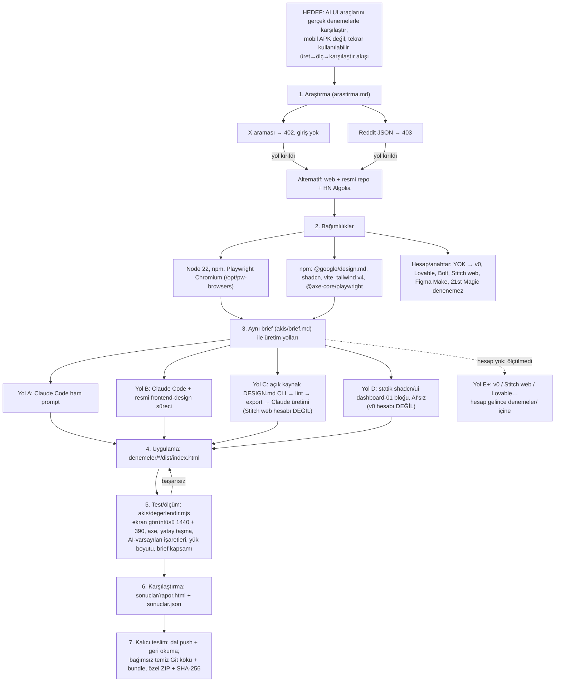

# Bağlı harita: hedef → bağımlılık → yollar → uygulama → test → teslim

## Zincirin düz metni
1. **Hedef** — kaynak satırı 1 ("siteleri çıkar, araştır, plan yap, tek tek uygula, hangisi iyi"), satır 5 ("halledene kadar"),
   satır 19 ("mobil uygulama değil, sistem"). Çıktı: araç envanteri + çalışan karşılaştırma akışı + gerçek deneme sonuçları.
2. **Bağımlılıklar** — yalnız hesapsız erişilebilen araçlar gerçek denemeye girebilir. Hesap gerektirenler envanterde
   "denenemedi" olarak, nedeniyle yazılır.
3. **Yollar** — A/B/C/D aynı brief'le; her biri tek statik `dist/index.html` üretir (D, Vite build ile).
   Yol kırılma planı: D'de shadcn CLI başarısız olursa registry JSON'u doğrudan indirip elle yerleştir;
   C'de CLI başarısız olursa repo klonundan `bun`/`tsx` ile çalıştır.
4. **Test** — `npm run karsilastir` tüm denemeleri aynı ölçütle puanlar; eşik: axe kritik/ciddi ihlal 0, mobilde yatay taşma yok.
5. **Teslim** — genel çıktılar dalda; özel kaynak yalnız ZIP'te.
