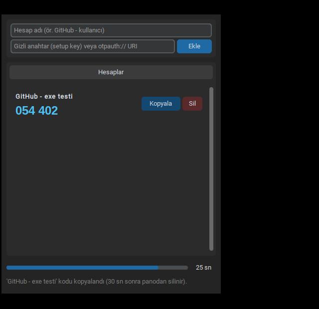

# Çevrimdışı TOTP — Windows masaüstü 2FA kod üretici

İnternete bağlanmayan, gizli anahtarları **Windows Credential Manager**'da (keyring) saklayan,
GitHub dahil standart TOTP kullanan servislerle uyumlu masaüstü 2FA uygulaması.



## Özellikler

- Hesap adı + gizli anahtar (GitHub “setup key”) veya `otpauth://` URI ile hesap ekleme
- Anahtar `keyring.set_password("My2FAApp", hesap_adi, gizli_anahtar)` ile Windows kasasına yazılır;
  diske, koda veya metin dosyasına **hiçbir** anahtar yazılmaz
- Her hesap için canlı 6 haneli kod, 30 sn geri sayım çubuğu, tek tıkla **Kopyala**
  (pano 30 sn sonra kendiliğinden temizlenir)
- Hesap silme (onaylı), Türkçe karakterli adlar, SHA256/SHA512, 8 hane, farklı periyot (URI ile)
- Güvenli kasa yoksa (ör. düz metin keyring) ekleme kapatılır
- Koyu tema, sabit pencere, tamamen çevrimdışı (ağ kütüphanesi yok)

## Kurulum

### Seçenek 1 — Hazır paket (ZIP içindeki `CevrimdisiTOTP.exe`)
1. ZIP'i açın, `CevrimdisiTOTP` klasörünü istediğiniz yere taşıyın (ör. `C:\Programlar\CevrimdisiTOTP`).
2. `CevrimdisiTOTP.exe`'yi çalıştırın. İmzasız olduğu için SmartScreen “Ek bilgi → Yine de çalıştır” isteyebilir.
3. ZIP'le birlikte gelen `SHA256SUMS.txt` ile dosyayı doğrulayabilirsiniz:
   `Get-FileHash .\CevrimdisiTOTP\CevrimdisiTOTP.exe -Algorithm SHA256`

### Seçenek 2 — Kaynaktan
```powershell
py -m pip install -r requirements.txt
py uygulama\totp_masaustu.py
```
Kendi `.exe`'nizi üretmek için: `build_windows.bat` → `dist\CevrimdisiTOTP\CevrimdisiTOTP.exe`

## GitHub 2FA'yı bu uygulamayla kurma

> Kısa cevap: **Evet**, GitHub'ın TOTP parametreleri (SHA1 / 6 hane / 30 sn) bu uygulamayla birebir uyumludur
> (bağımsız oathtool ile 50/50 eşleşme). Ama **kurtarma kodlarını mutlaka indirin**.

1. GitHub → **Settings → Password and authentication → Two-factor authentication → Enable**.
2. QR kodunun altındaki **“setup key”** bağlantısına tıklayın; görünen metni kopyalayın.
3. Uygulamada *Hesap adı*: `GitHub - kullaniciadi`, *Gizli anahtar*: kopyaladığınız setup key → **Ekle**.
4. Uygulamadaki 6 haneli kodu GitHub'daki doğrulama kutusuna girin.
5. GitHub'ın verdiği **kurtarma kodlarını indirin** ve bilgisayar dışında (kâğıt/USB/başka cihaz) saklayın.
6. GitHub 28 gün içinde bir “check-up” ister; o sürede en az bir kez 2FA ile giriş yapın.

Kaynak: https://docs.github.com/en/authentication/securing-your-account-with-two-factor-authentication-2fa/configuring-two-factor-authentication

### Bilmeniz gerekenler (dürüst sınırlar)
- **Saat doğru olmalı.** Uygulama çevrimdışı olduğu için saati kendisi düzeltmez. Kodlar reddedilirse
  Windows → *Ayarlar → Saat ve dil → Şimdi eşitle*.
- **Tek cihaz riski.** Parolanız ve 2FA kodunuz aynı bilgisayardaysa, o bilgisayarı ele geçiren ikisine de
  ulaşabilir. Telefonda ikinci bir authenticator'a aynı setup key'i eklemek veya bir donanım anahtarı
  (passkey/security key) eklemek daha güçlüdür.
- **Yedek yok.** Anahtarlar yalnız bu Windows kullanıcı hesabının Credential Manager'ındadır. Windows'u
  sıfırlarsanız veya kullanıcıyı silerseniz anahtarlar gider → kurtarma kodları şart.
- Credential Manager ayrı bir ana parola istemez; Windows oturumunuz açıkken çalışan yazılımlar okuyabilir.
  Daha güçlü izolasyon isterseniz KeePassXC (ana parolalı veritabanı) alternatif olarak `harita.md`'de.
- Kayıtlar *Denetim Masası → Kimlik Bilgileri Yöneticisi → Windows Kimlik Bilgileri* altında
  `My2FAApp` adıyla görünür.

## Windows kabul listesi (kullanıcının kendi makinesinde)

Bulut ortamında Windows yoktu; testler Wine 9.0 + resmi Windows Python 3.12.10 ile yapıldı.
Gerçek Windows 10/11'de şu 8 adımı bir kez yapmanız önerilir:

1. `CevrimdisiTOTP.exe` açılıyor, alt satırda `Kasa: WinVaultKeyring · çevrimdışı` yazıyor.
2. Test hesabı: ad `Deneme`, anahtar `JBSWY3DPEHPK3PXP` (herkese açık örnek anahtar) → Ekle.
3. Telefonunuzdaki authenticator'a aynı örnek anahtarı elle ekleyin; iki kod aynı olmalı
   (sonra telefondaki örneği silin).
4. Geri sayım 0'a gelince kod kendiliğinden değişiyor.
5. **Kopyala** → Not Defteri'ne yapıştır → aynı 6 hane; 30 sn sonra pano boş.
6. Uygulamayı kapatıp açın: `Deneme` duruyor.
7. Kimlik Bilgileri Yöneticisi'nde `My2FAApp` kaydı görünüyor; `%APPDATA%` / uygulama klasöründe anahtar içeren dosya yok.
8. `Deneme` → Sil → onay → kayıt Kimlik Bilgileri Yöneticisi'nden de kalkıyor.

## Klasör yapısı

| Yol | İçerik |
|---|---|
| `uygulama/totp_masaustu.py` | Uygulamanın tamamı (tek dosya, Türkçe yorumlu) |
| `testler/` | pytest testleri (RFC 6238, GitHub uyumu, kasa, çevrimdışılık, Windows kasa) |
| `kanit/` | Test çıktıları, GUI sürücüsü, ekran görüntüleri, oathtool çapraz kontrolü |
| `build_windows.bat` | Windows'ta `.exe` üretimi |
| `harita.md` | Araştırma, A/B/C yolları, karar ve doğrulama haritası |
| `calisma-gunlugu.md` | Yapılan işlerin sıralı günlüğü |

Testleri çalıştırma: `py -m pytest testler -v`
