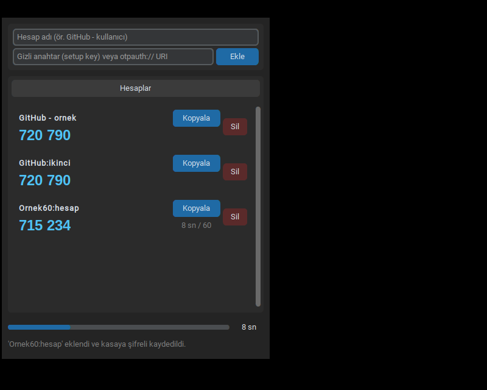

# Çevrimdışı TOTP — Windows masaüstü 2FA kod üretici (1.0.1)

İnternete bağlanmayan, gizli anahtarları **yalnız Windows Credential Manager**'da (keyring → WinVaultKeyring)
saklayan, GitHub dahil standart TOTP kullanan servislerle uyumlu masaüstü 2FA uygulaması.



## Özellikler

- Hesap adı + gizli anahtar (GitHub “setup key”) veya `otpauth://` URI ile hesap ekleme (düğme veya Enter)
- Anahtar `keyring.set_password("My2FAApp", hesap_adi, gizli_anahtar)` ile Windows kasasına yazılır;
  diske, koda veya metin dosyasına **hiçbir** anahtar yazılmaz
- Her hesap için canlı kod, 30 sn geri sayım çubuğu, tek tıkla **Kopyala**;
  30 sn'den farklı periyotlu hesaplar (URI ile) satırında **kendi sayacını** gösterir
- Hesap silme (onaylı); silme kasada doğrulanmadan “silindi” denmez
- Koyu tema, sabit pencere, tamamen çevrimdışı (ağ kütüphanesi yok)

## Güvenlik davranışı (1.0.1)

| Konu | Davranış |
|---|---|
| Kasa politikası | İzin listesi: Windows'ta **yalnız** `WinVaultKeyring`. Bilinmeyen, düz metin, boş veya zincirde tek bir yabancı arka uç bile → reddedilir (fail-closed). Politika **her** okuma/yazmadan önce yeniden denetlenir. |
| Açılış sağlık testi | Rastgele bir deneme kaydı yazılır, geri okunur, silinir ve silindiği doğrulanır. Başarısızsa “Ekle” kapanır. |
| Kapalı “Ekle” | Enter kısayolu ve doğrudan çağrı da engellenir (hem arayüzde hem kasa katmanında). |
| Hesap listesi | Hesap adları keyring'de nesil numaralı parçalar + SHA-256'lı tek işaretçiyle tutulur. Yarım kalan yazım eski listeyi bozmaz; bozuk/eksik liste → hata (sessizce boş liste değil). |
| Ekleme | Aynı adla listede olmayan bir kayıt kasada varsa **üzerine yazılmaz**. Liste yazılamazsa eklenen anahtar geri alınır. |
| Silme | Kasa silmeyi reddeder veya kayıt hâlâ duruyorsa hata gösterilir, hesap listede kalır. Liste yazılamazsa anahtar geri yüklenir. |
| URI denetimi | `issuer` parametresi etiketteki servis adıyla uyuşmalı; yinelenen parametre (ör. iki `secret`) ve kontrol karakterleri (`%00`, `%0A`, yön değiştirme karakterleri) reddedilir. |
| Sızıntı | Anahtar `repr`/`str` çıktısında görünmez; hata mesajları geçersiz karakterleri veya anahtar parçalarını yansıtmaz; arka ucun ham hata metni kullanıcıya gösterilmez. |
| Pano | Kopyalanan kod 30 sn sonra, pano **hâlâ o kodu** tutuyorsa silinir; kullanıcı arada başka şey kopyaladıysa dokunulmaz. Normal kapanışta da (X düğmesi) aynı kural uygulanır. |
| 1.0.0'dan geçiş | Eski liste biçimi okunur ve ilk değişiklikte yeni biçime taşınır. |

### Garanti verilmeyenler
- **Pano geçmişi / bulut panosu:** Windows pano geçmişi (Win+V) veya bulut panosu açıksa kopyalanan kod orada kalabilir.
  Uygulama bunu engelleyemez; gerekiyorsa *Ayarlar → Sistem → Pano → Pano geçmişi* kapatılabilir.
- **Çökme / zorla sonlandırma:** Görev Yöneticisi'nden sonlandırma, elektrik kesintisi veya çökme durumunda pano temizlenmez.
- **Oturum güvenliği:** Credential Manager ayrı bir ana parola istemez; Windows oturumunuz açıkken aynı kullanıcıyla
  çalışan yazılımlar kayıtları okuyabilir. Daha güçlü izolasyon için KeePassXC gibi ana parolalı bir alternatif `harita.md`'de.

## Kurulum

### Seçenek 1 — Hazır paket (ZIP içindeki `CevrimdisiTOTP.exe`)
1. ZIP'i açın, `CevrimdisiTOTP` klasörünü bütün olarak taşıyın (`_internal` gerekli).
2. `CevrimdisiTOTP.exe`'yi çalıştırın. İmzasız olduğu için SmartScreen “Ek bilgi → Yine de çalıştır” isteyebilir.
3. Doğrulama: `Get-FileHash .\CevrimdisiTOTP\CevrimdisiTOTP.exe -Algorithm SHA256` → ZIP içindeki `SHA256SUMS.txt` ile karşılaştırın.

### Seçenek 2 — Kaynaktan (Python 3.12 x64)
```powershell
py -3.12 -m pip install --require-hashes --no-deps --only-binary=:all: -r requirements-windows.lock
py -3.12 uygulama\totp_masaustu.py
py -3.12 uygulama\totp_masaustu.py --kasa-tani   # kasa politikası + sağlık testi
```
Kendi `.exe`'nizi üretmek için `build_windows.bat` (hash'li `requirements-build-windows.lock` ile yalıtılmış venv).
`requirements.txt` yalnız geliştirme içindir (esnek aralıklar).

## GitHub 2FA'yı bu uygulamayla kurma

> GitHub'ın TOTP parametreleri (SHA1 / 6 hane / 30 sn) bu uygulamayla uyumludur (bağımsız oathtool ile 50/50 eşleşme).
> **Kurtarma kodlarını mutlaka indirin.**

1. GitHub → **Settings → Password and authentication → Two-factor authentication → Enable**.
2. QR kodunun altındaki **“setup key”** bağlantısına tıklayın; görünen metni kopyalayın.
3. Uygulamada *Hesap adı*: `GitHub - kullaniciadi`, *Gizli anahtar*: kopyaladığınız setup key → **Ekle**.
4. Uygulamadaki 6 haneli kodu GitHub'daki doğrulama kutusuna girin.
5. GitHub'ın verdiği **kurtarma kodlarını indirin** ve bilgisayar dışında saklayın.
6. GitHub 28 gün içinde bir “check-up” ister; o sürede en az bir kez 2FA ile giriş yapın.

Kaynak: https://docs.github.com/en/authentication/securing-your-account-with-two-factor-authentication-2fa/configuring-two-factor-authentication

Diğer sınırlar: saat doğru olmalı (*Ayarlar → Saat ve dil → Şimdi eşitle*); anahtarlar yalnız bu Windows kullanıcısındadır
(Windows sıfırlanırsa gider → kurtarma kodları şart); parola ve 2FA aynı bilgisayardaysa ikinci faktörün bağımsızlığı zayıflar.

## Kabul durumu — Wine ile yapılan ve native Windows'ta yapılacak olan AYRIDIR

### A) Wine kabulü — YAPILDI (bulut, Linux üzerinde Wine 9.0 + resmi Windows CPython 3.12.10)
| Kontrol | Sonuç | Kanıt |
|---|---|---|
| pytest (gerçek WinVaultKeyring dahil) | 77/77 | `kanit/test-windows-wine.txt` |
| Arayüz akışı: izinsiz kasa + Enter engeli, ekleme, 60 sn sayacı, gerçek zamanlı 30 sn pano temizliği, başka pano içeriğine dokunmama, kontrol deneyi + erken kapanış, silme hatası, yeniden açılış | 25/25 | `kanit/gui-wine-windows-cikti.txt`, `kanit/wine-windows-*.png` |
| Paketlenmiş `.exe`: Enter ile ekle → Kopyala → WM_CLOSE (X düğmesi eşdeğeri) sonrası pano boş → yeniden açılış → onaylı silme | Geçti | `kanit/exe-akis-cikti.txt`, `kanit/exe-*.png` |
| Hash'li kilit: temiz venv'e kurulum + bozuk hash reddi | Geçti | `kanit/kilit-dogrulama.txt` |

Wine, Windows API'sini kendi kodu ile uygular: Credential Manager kayıtları Wine'ın kendi deposunda tutulur,
**gerçek DPAPI şifrelemesi, SmartScreen, Windows pano geçmişi ve gerçek pencere yöneticisi davranışı Wine ile kanıtlanmaz.**

### B) Native Windows 10/11 kabulü — YAPILMADI (kullanıcının makinesi gerekir)
1. `CevrimdisiTOTP.exe` açılıyor; alt satırda `Kasa: Windows.WinVaultKeyring · çevrimdışı` yazıyor.
2. Test hesabı: ad `Deneme`, anahtar `JBSWY3DPEHPK3PXP` (herkese açık örnek anahtar) → **Enter**.
3. Telefondaki authenticator'a aynı örnek anahtarı ekleyin; iki kod aynı olmalı (sonra telefondaki örneği silin).
4. Geri sayım 0'a gelince kod kendiliğinden değişiyor.
5. **Kopyala** → Not Defteri'ne yapıştır → aynı 6 hane; ~30 sn sonra yapıştırınca boş.
6. **Kopyala** → hemen başka bir metin kopyala → 30 sn bekle → başka metin duruyor (dokunulmadı).
7. **Kopyala** → pencereyi X ile kapat → Not Defteri'ne yapıştır → boş.
8. Uygulamayı açın: `Deneme` duruyor. *Kimlik Bilgileri Yöneticisi → Windows Kimlik Bilgileri*'nde `My2FAApp` kayıtları
   görünüyor; uygulama klasöründe veya `%APPDATA%`'da anahtar içeren dosya yok.
9. `Deneme` → Sil → Evet → kayıt hem listeden hem Kimlik Bilgileri Yöneticisi'nden kalkıyor.
10. `py -3.12 -m pytest testler -v` (kaynaktan) → Windows'a özel 2 test dahil hepsi geçmeli.

## Klasör yapısı

| Yol | İçerik |
|---|---|
| `uygulama/totp_masaustu.py` | Uygulamanın tamamı (tek dosya, Türkçe yorumlu) |
| `testler/` | pytest: RFC 6238, GitHub uyumu, kasa politikası/geri alma, URI, sızıntı, Windows kasa |
| `kanit/` | Test çıktıları, GUI ve exe sürücüleri, ekran görüntüleri, oathtool çapraz kontrolü, mutasyon testi |
| `requirements-windows.lock`, `requirements-build-windows.lock` | Hash'li kilitler (Windows x64, CPython 3.12) |
| `build_windows.bat` | Windows'ta `.exe` üretimi |
| `harita.md` | Araştırma, A/B/C yolları, karar ve doğrulama haritası |
| `calisma-gunlugu.md` | Yapılan işlerin sıralı günlüğü |
