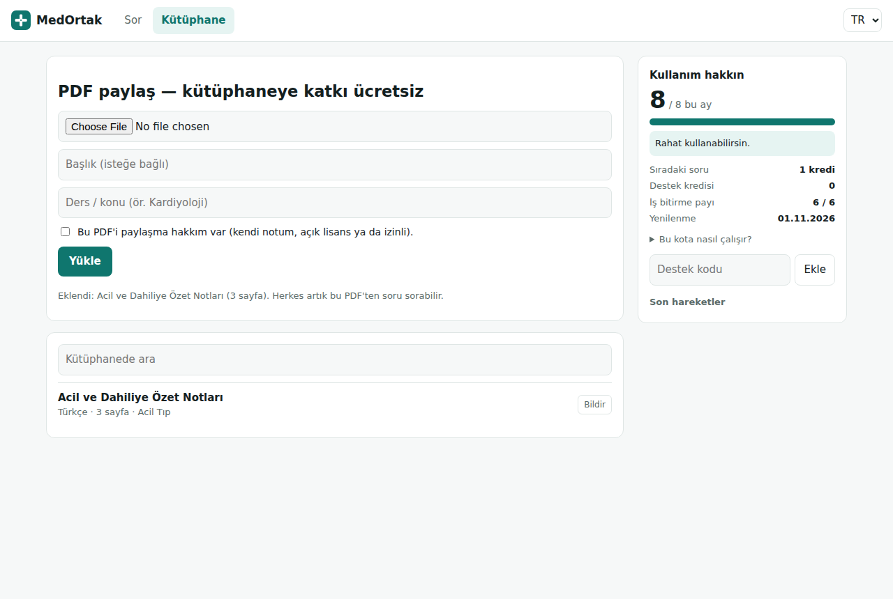
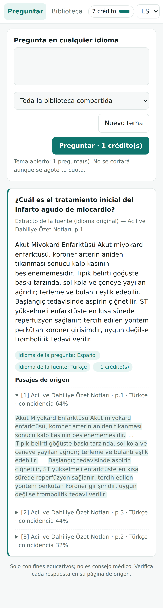
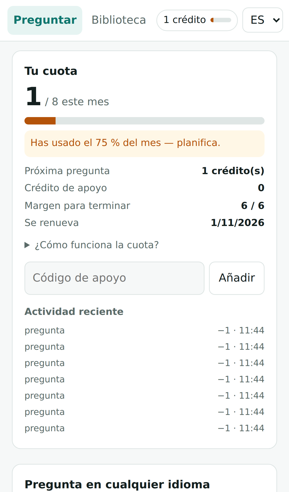
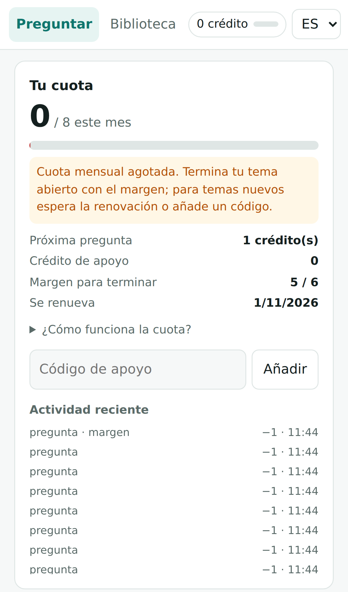
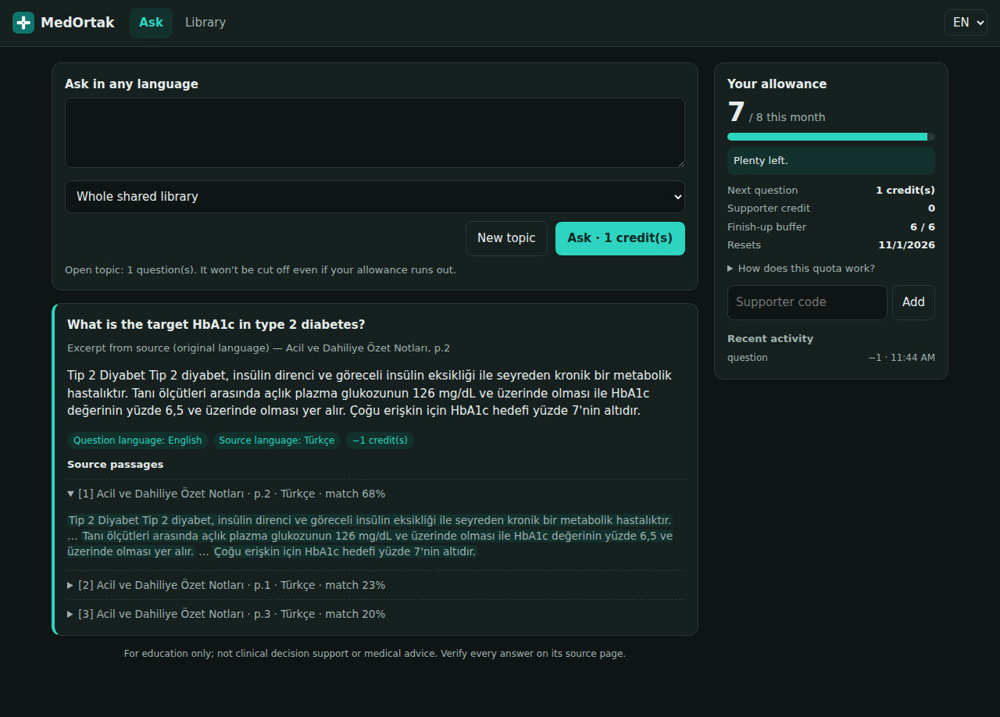

# MedOrtak — Ortak Tıbbi PDF Soru-Cevap

Tıp öğrencileri PDF'lerini **ortak kütüphaneye** yükler. Herkes **istediği dilde** soru sorar ve sayfa numaralı, kaynaklı yanıt alır. Örneğin İspanyolca bir soru, Türkçe bir PDF'ten yanıtlanır. Giriş yok, kart yok. Kota her zaman ekranın sağında görünür ve başlanmış bir konu kota bitse bile yarıda kesilmez.

| Masaüstü (TR) | Mobil (ES) | Kota uyarısı | İş bitirme payı | Koyu tema (EN) |
|---|---|---|---|---|
|  |  |  |  |  |

## Çalıştırma

```bash
# Docker (çok dilli model imajın içinde gelir)
docker build -t medortak .
docker run -p 8000:8000 -v medortak-data:/data medortak
# → http://localhost:8000  (telefonda “Ana ekrana ekle” ile uygulama gibi kurulur; HTTPS gerekir)

# Docker'sız
pip install -r requirements.txt
uvicorn app.main:app --port 8000      # ilk açılışta model (~240 MB) indirilir
```

Yerel ağda telefondan denemek için `--host 0.0.0.0` ekleyin. PWA kurulumu ve service worker yalnız HTTPS'te ya da `localhost`'ta çalışır, bu yüzden canlı kullanım için bir HTTPS ters vekil sunucu (Caddy, nginx) gerekir.

## Ayarlar (ortam değişkenleri)

| Değişken | Varsayılan | Anlamı |
|---|---|---|
| `MEDPDF_MONTHLY_FREE` | 60 | Herkese eşit aylık ücretsiz kredi |
| `MEDPDF_GRACE` | 6 | Kredili başlamış konuyu bitirmek için ek pay |
| `MEDPDF_COST_QUESTION` / `_AI` | 1 / 3 | Soru başı kredi (alıntı / YZ özeti) |
| `MEDPDF_COST_UPLOAD` | 0 | PDF katkısı ücretsiz |
| `MEDPDF_DONATE_URL` | boş | Ko-fi / Open Collective / GitHub Sponsors bağlantısı. Boşsa düğme gizlenir. |
| `MEDPDF_ADMIN_TOKEN` | boş | Yönetici uçları (destek kodu, bildirimler) |
| `MEDPDF_ANTHROPIC_API_KEY` | boş | Verilirse "kendi dilimde YZ özeti" seçeneği açılır |
| `MEDPDF_MAX_UPLOAD_MB` / `_MAX_PAGES` | 40 / 1500 | Yükleme sınırları |
| `MEDPDF_NEW_DEVICES_PER_IP` | 5 | Bir IP'den günde açılabilecek yeni cihaz sayısı (kota kötüye kullanımına karşı) |

**Bağış → kredi akışı (kart istemeden):** Kullanıcı bağış platformunda destek olur. Yönetici bir destek kodu üretir:

```bash
curl -H "X-Admin-Token: $T" -H 'content-type: application/json' -d '{"credits":200,"note":"ko-fi #12"}' https://alanadi/api/admin/codes
```

Kullanıcı bu kodu sağdaki panele girer. Destek kredisi aylık hakkın üstüne eklenir ve süresi dolmaz.

## Mimari

```
PDF ─► PyMuPDF metin (sayfa) ─► ~900 karakterlik parça ─► çok dilli gömme (yerel ONNX, 384 boyut) ─► SQLite
Soru (herhangi bir dil) ─► gömme ─► kosinüs benzerliği (tüm ortak kütüphane) ─► en iyi 5 parça
   ─► en ilgili cümleler (anlam + diller arası ortak terim) ─► kaynaklı alıntı yanıtı
   └► (isteğe bağlı) Claude: soru dilinde özet + [n] atıf; hata olursa alıntıya geri düşer
Kota: anonim cihaz ─► aylık ücretsiz → destek kredisi → iş bitirme payı (yalnız kredili başlamış konu)
```

Ayrıntılar için [harita.md](harita.md) (A/B/C yolları), [arastirma.md](arastirma.md) (kaynaklar) ve [calisma-gunlugu.md](calisma-gunlugu.md) dosyalarına bakın.

## Test

```bash
pip install -r requirements-dev.txt
pytest -v tests/                                   # gerçek PDF + gerçek model + HTTP API
python scripts/make_sample_pdfs.py samples
MEDPDF_MONTHLY_FREE=8 uvicorn app.main:app --port 8765 &
python scripts/e2e.py http://127.0.0.1:8765 samples out/   # masaüstü + iPhone 13 tarayıcı akışı
```

## Sınırlar (dürüst liste)

- **YZ özeti doğrulanmadı:** Soru dilinde çeviri ve özet, API anahtarı gerektirdiği için gerçek API'ye karşı test edilmedi. Anahtar olmadan alıntı, PDF'in kendi dilinde gösteriliyor (ör. İspanyolca soruya Türkçe kaynak cümlesi geliyor). Soru dili ve kaynak dili etiketlerle açıkça belirtiliyor.
- **Taranmış PDF:** Metin katmanı yoksa sistem reddeder ve OCR'li sürüm ister. OCR yapılmıyor.
- **Ödeme:** Kart ve Stripe entegrasyonu yok; bilinçli olarak kartsız bağış ve destek kodu modeli seçildi. Otomatik ödeme ileride Stripe anahtarı ve şirket hesabıyla eklenebilir.
- **Anonim kimlik:** Tarayıcı verisi silinirse yeni cihaz açılır. Bunu IP başına günlük cihaz sınırı yumuşatıyor ama tamamen engellemiyor.
- **Telif:** Telif bildirimi gelince belge anında gizleniyor. ABD DMCA güvenli liman koruması için gerçek bir temsilci kaydı kurucu tarafından yapılmalıdır.
- **Yanıtların niteliği:** Yanıtlar eğitim amaçlıdır ve klinik karar yerine geçmez. Örnek PDF'ler test için yazılmış özgün kısa metinlerdir.
