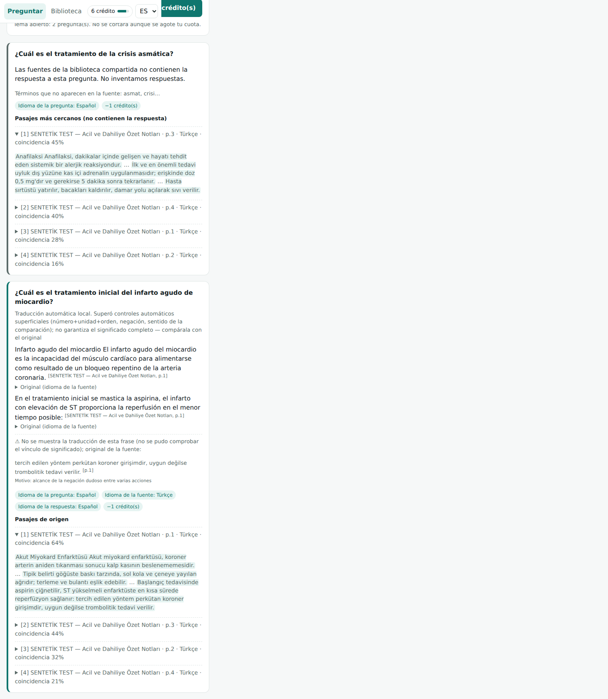

# MedOrtak — Ortak Tıbbi PDF Soru-Cevap

Tıp öğrencileri PDF'lerini **ortak kütüphaneye** yükler. Herkes **istediği dilde** soru sorar ve sayfa numaralı, kaynaklı yanıt alır. Örneğin İspanyolca bir soru, Türkçe bir PDF'ten **İspanyolca** yanıtlanır. Bunun için API anahtarı gerekmez: yerel çeviri modeli kullanılır ve sayı, birim, olumsuzluk ile karşılaştırma ifadeleri denetlenir. Kaynakta cevap yoksa sistem bunu açıkça söyler. Giriş yok, kart yok. Kota her zaman ekranın sağında görünür ve başlanmış bir konu kota bitse bile yarıda kesilmez.

| Masaüstü (TR) | Mobil (ES) | Kota uyarısı | İş bitirme payı | Koyu tema (EN) |
|---|---|---|---|---|
|  |   |  |  |  |

## Çalıştırma

```bash
# Docker (çok dilli model imajın içinde gelir)
docker build -t medortak .
docker run -p 8000:8000 -v medortak-data:/data medortak
# → http://localhost:8000  (telefonda “Ana ekrana ekle” ile uygulama gibi kurulur; HTTPS gerekir)

# Docker'sız
pip install -r requirements.txt
scripts/fetch_mt_models.sh            # tek seferlik: çeviri modellerini indirip dönüştürür (~315 MB, geçici venv)
uvicorn app.main:app --port 8000      # ilk açılışta arama modeli (~240 MB) indirilir
```

Yerel ağda telefondan denemek için `--host 0.0.0.0` ekleyin. PWA kurulumu ve service worker yalnız HTTPS'te ya da `localhost`'ta çalışır, bu yüzden canlı kullanım için bir HTTPS ters vekil sunucu (Caddy, nginx) gerekir.

## Ayarlar (ortam değişkenleri)

| Değişken | Varsayılan | Anlamı |
|---|---|---|
| `MEDPDF_MONTHLY_FREE` | 60 | Herkese eşit aylık ücretsiz kredi |
| `MEDPDF_GRACE` | 6 | Kredili başlamış konuyu bitirmek için ek pay |
| `MEDPDF_COST_QUESTION` / `_AI` | 1 / 3 | Soru başı kredi (alıntı / YZ özeti) |
| `MEDPDF_COST_UPLOAD` | 0 | PDF katkısı ücretsiz |
| `MEDPDF_DONATE_URL` | boş | Ko-fi / Open Collective / GitHub Sponsors bağlantısı. Boşsa düğme gizlenir. |
| `MEDPDF_ADMIN_TOKEN` | boş | Yönetici uçları (destek kodu, bildirimler) |
| `MEDPDF_MT_DIR` / `MEDPDF_MT_THREADS` | `models/mt` / 4 | Yerel çeviri modelleri ve CPU iş parçacığı sayısı |
| `MEDPDF_ANTHROPIC_API_KEY` | boş | Verilirse "YZ ile özetle" seçeneği açılır (isteğe bağlı; çeviri için gerekmez) |
| `MEDPDF_MAX_UPLOAD_MB` / `_MAX_PAGES` | 40 / 1500 | Yükleme sınırları |
| `MEDPDF_NEW_DEVICES_PER_IP` | 5 | Bir IP'den günde açılabilecek yeni cihaz sayısı (kota kötüye kullanımına karşı) |

**Bağış → kredi akışı (kart istemeden):** Kullanıcı bağış platformunda destek olur. Yönetici bir destek kodu üretir:

```bash
curl -H "X-Admin-Token: $T" -H 'content-type: application/json' -d '{"credits":200,"note":"ko-fi #12"}' https://alanadi/api/admin/codes
```

Kullanıcı bu kodu sağdaki panele girer. Destek kredisi aylık hakkın üstüne eklenir ve süresi dolmaz.

## Mimari

```
PDF ─► PyMuPDF metin (sayfa) ─► ~900 karakterlik parça ─► çok dilli gömme (yerel ONNX, 384 boyut) ─► SQLite
Soru (herhangi bir dil) ─► gömme ─► kosinüs benzerliği (tüm ortak kütüphane) ─► en iyi 5 parça
   ─► kaynak dil ≠ soru dili ise: bölüm cümleleri yerel MT ile çevrilir (OPUS-MT, CTranslate2 int8)
        • her cümleden 6 aday çeviri alınır; sayı, birim, olumsuzluk ya da altında/üzerinde bozulmuşsa aday reddedilir
        • sorunun konu terimleri çeviride yoksa sıradaki bölüm denenir (en fazla 3); hiçbirinde yoksa "cevap yok"
        • cevap = en ilgili 3 doğrulanmış cümle + sayfa atfı + açılabilir orijinal
   └► (isteğe bağlı) Claude: soru dilinde özet + [n] atıf; hata olursa alıntıya geri düşer
Kota: anonim cihaz ─► aylık ücretsiz → destek kredisi → iş bitirme payı (yalnız kredili başlamış konu)
```

Ayrıntılar için [harita.md](harita.md) (A/B/C yolları), [arastirma.md](arastirma.md) (kaynaklar) ve [calisma-gunlugu.md](calisma-gunlugu.md) dosyalarına bakın.

## Test

```bash
pip install -r requirements-dev.txt
scripts/fetch_mt_models.sh                         # çeviri modelleri (testler bunlar olmadan başarısız olur)
pytest -v tests/                                   # gerçek PDF + gerçek arama/çeviri modelleri + HTTP API (49 test)
python scripts/make_sample_pdfs.py samples
MEDPDF_MONTHLY_FREE=8 uvicorn app.main:app --port 8765 &
python scripts/e2e.py http://127.0.0.1:8765 samples out/   # masaüstü + iPhone 13 tarayıcı akışı
```

## Sınırlar (dürüst liste)

- **Yerel çeviri yalnız Türkçe kaynak için:** Hedef dil İspanyolca, İngilizce, Portekizce, Fransızca ya da Almanca olabilir. Diğer kaynak dillerinde sistem "unsupported_pair" uyarısı verip alıntıyı kaynak dilinde gösterir.
- **Denetim yüzeyseldir, "doğrulandı" değildir.** Denetlenenler: sayı ile birimin eşleşmesi ve sırası, birebir geçen varlık sözcükleriyle nicelik-özne bağı, yüklem bazında olumsuzluk, altında/üzerinde yönü (es/en/pt/fr/de).
  - Aynı birimli birden çok doz ya da karışık olumlu/olumsuz çok eylemli cümlede bağ kanıtlanamadığı için çeviri gösterilmez; Türkçe orijinal gerekçesiyle sunulur.
  - Özne kayması gibi anlam hataları yakalanmaz. Örnek: "el infarto … proporciona la reperfusión".
- **Denetim terim hatasını yakalamaz:** Sayı, birim, olumsuzluk ve karşılaştırma korunuyor ama terim kayması kaçabiliyor. Örnek: "açlık plazma glukozu" → "glucosa plasmática de *hambre*" (doğrusu "ayuno"). Bu yüzden her cümlenin Türkçe orijinali açılabilir durumda.
- **"Cevap yok" tespiti temkinli:** Eşanlamlıda kaçabilir. Örnek: soruda "temperatura", kaynakta "ateş" (çeviride "fiebre") geçiyor; sistem cevap vermek yerine "yok" diyor.
- **Hız ve boyut:** Bir soru 4 çekirdekte 2–7 saniye sürüyor. Docker imajı 1,92 GB (arama + çeviri modelleri gömülü).
- **YZ özeti doğrulanmadı:** Claude kipi API anahtarı gerektirdiği için gerçek API'ye karşı test edilmedi; çok dilli cevap bu kipe bağlı değil.
- **Taranmış PDF:** Metin katmanı yoksa sistem reddeder ve OCR'li sürüm ister. OCR yapılmıyor.
- **Ödeme:** Kart ve Stripe entegrasyonu yok; bilinçli olarak kartsız bağış ve destek kodu modeli seçildi. Otomatik ödeme ileride Stripe anahtarı ve şirket hesabıyla eklenebilir.
- **Anonim kimlik:** Tarayıcı verisi silinirse yeni cihaz açılır. Bunu IP başına günlük cihaz sınırı yumuşatıyor ama tamamen engellemiyor.
- **Telif:** Telif bildirimi gelince belge anında gizleniyor. ABD DMCA güvenli liman koruması için gerçek bir temsilci kaydı kurucu tarafından yapılmalıdır.
- **Yanıtların niteliği:** Yanıtlar eğitim amaçlıdır ve klinik karar yerine geçmez. Örnek PDF'ler test için yazılmış özgün kısa metinlerdir.
